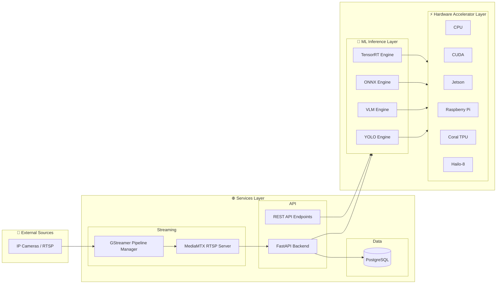

# 🏗️ Architecture

This document describes the system layout and how data flows through Carcara NVC.

## High-level View

## 📝 Notes

- The API coordinates model selection and inference requests.
- Hardware acceleration is selected by the accelerator backend and runtime config.
- Streaming uses GStreamer pipelines and MediaMTX for distribution.
