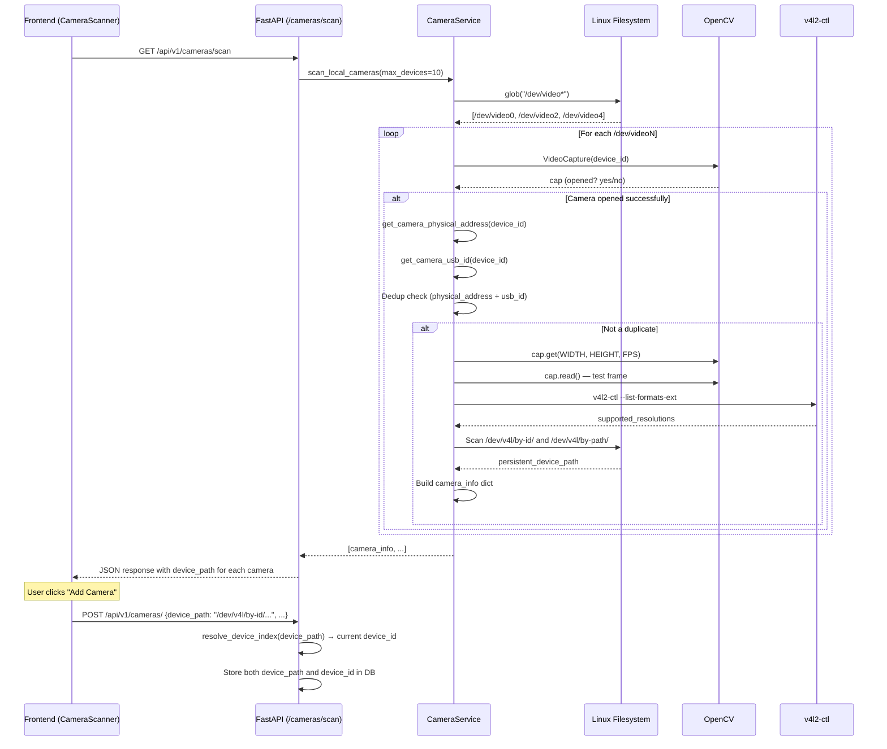

# Local Camera Scan Architecture

> **Persistent V4L2 Device Identification**
> Last Updated: February 2026

---

## Table of Contents

1. [Problem Statement](#problem-statement)
2. [Solution Overview](#solution-overview)
3. [Architecture](#architecture)
4. [Device Path Resolution](#device-path-resolution)
5. [Scan Flow](#scan-flow)
6. [Data Model](#data-model)
7. [API Reference](#api-reference)
8. [Streaming Pipeline](#streaming-pipeline)
9. [Frontend Integration](#frontend-integration)
10. [Edge Cases & Fallbacks](#edge-cases--fallbacks)

---

## Problem Statement

Linux assigns V4L2 (Video4Linux2) device indices dynamically at boot time and whenever USB cameras are plugged/unplugged. For example, a camera may appear as `/dev/video0` on one boot and `/dev/video2` on the next. If the system stores only the integer index (`device_id = 0`), it will reference the **wrong camera** — or no camera at all — after a reboot or re-scan.

### Failure Scenario

```
Boot 1:                        Boot 2:
  /dev/video0 → Logitech C920    /dev/video0 → Intel RealSense (swapped!)
  /dev/video2 → Intel RealSense  /dev/video2 → Logitech C920
```

A camera saved with `device_id=0` now points to a completely different physical device.

---

## Solution Overview

The system uses **persistent Linux device symlinks** maintained by `udev` as stable identifiers:

| Path                   | Stability                        | Example                                                            |
| ---------------------- | -------------------------------- | ------------------------------------------------------------------ |
| `/dev/v4l/by-id/...`   | Unique per physical device       | `/dev/v4l/by-id/usb-046d_HD_Pro_Webcam_C920_AB1234EF-video-index0` |
| `/dev/v4l/by-path/...` | Stable per physical USB port     | `/dev/v4l/by-path/pci-0000:00:14.0-usb-0:2:1.0-video-index0`       |
| `/dev/videoN`          | **Volatile** — changes on reboot | `/dev/video0`                                                      |

The `by-id` symlink is preferred because it follows the physical device regardless of which USB port it is connected to. The `by-path` symlink is a fallback — stable as long as the camera stays in the same port.

### Key Principle

> **Store `device_path` (persistent symlink). Resolve to `/dev/videoN` at runtime.**

---

## Architecture

```
┌──────────────────────────────────────────────────────────────────────┐
│                        Linux Kernel (udev)                          │
│                                                                      │
│  /dev/video0  ◄──── /dev/v4l/by-id/usb-046d_C920_AB12-video-index0  │
│  /dev/video2  ◄──── /dev/v4l/by-id/usb-8086_RealSense-video-index0  │
└──────────────────────────────────────────────────────────────────────┘
        │                          │
        ▼                          ▼
┌───────────────┐    ┌─────────────────────────────┐
│  OpenCV       │    │  GStreamer (v4l2src)         │
│  (detection)  │    │  (streaming pipeline)       │
│               │    │                              │
│  Uses integer │    │  Uses resolved device path   │
│  index for    │    │  device=/dev/video0          │
│  cv2.Video-   │    │                              │
│  Capture(0)   │    │                              │
└───────────────┘    └─────────────────────────────┘
        │                          │
        ▼                          ▼
┌──────────────────────────────────────────────────────────────────────┐
│                     CameraService (backend)                          │
│                                                                      │
│  get_persistent_device_path(device_id) → /dev/v4l/by-id/...         │
│  resolve_device_path(device_path)      → /dev/videoN (real)         │
│  resolve_device_index(device_path)     → int (e.g. 0)              │
│  device_path_for_opencv(device_path)   → int | str                 │
└──────────────────────────────────────────────────────────────────────┘
        │
        ▼
┌──────────────────────────────────────────────────────────────────────┐
│                     PostgreSQL (cameras table)                       │
│                                                                      │
│  id | name       | device_id | device_path                          │
│  1  | Webcam C920|     0     | /dev/v4l/by-id/usb-046d_C920_AB12…  │
│  2  | RealSense  |     2     | /dev/v4l/by-id/usb-8086_RealSense…  │
└──────────────────────────────────────────────────────────────────────┘
```

---

## Device Path Resolution

The `CameraService` class provides a set of static methods for device path resolution:

### `get_persistent_device_path(device_id: int) → str | None`

Finds the best persistent symlink for a given V4L2 index:

1. Resolves `/dev/videoN` to its real path via `os.path.realpath`
2. Searches `/dev/v4l/by-id/` for a symlink pointing to the same real device
3. Falls back to `/dev/v4l/by-path/` if no `by-id` match is found
4. Returns `None` if no persistent symlink exists (e.g., virtual cameras, some VMs)

### `resolve_device_path(device_path: str) → str`

Resolves any device path (persistent symlink or direct) to the real `/dev/videoN` node using `os.path.realpath`. Idempotent on already-resolved paths.

### `resolve_device_index(device_path: str) → int | None`

Extracts the integer V4L2 index from a device path:

```
/dev/v4l/by-id/usb-046d_...-video-index0  →  resolves to /dev/video0  →  returns 0
/dev/video2                                 →  returns 2
/dev/v4l/by-path/pci-...-video-index0      →  resolves to /dev/video0  →  returns 0
```

### `device_path_for_opencv(device_path: str) → int | str`

Returns the best argument for `cv2.VideoCapture()`:

- Prefers the integer index (some OpenCV builds only support integers on Linux)
- Falls back to the resolved real path

### `_dev_path_or_index(device_path, device_id) → str`

Internal helper that accepts either parameter and returns a `/dev/videoN` path. Used by `get_camera_name()`, `get_supported_resolutions()`, and other metadata helpers.

---

## Scan Flow



### Deduplication

Many USB cameras register multiple `/dev/videoN` nodes (e.g., one for video capture, one for metadata). The scan deduplicates by tracking `(physical_address, usb_id)` tuples. Only the first node per physical device is returned.

---

## Data Model

### Camera Table (PostgreSQL)

```sql
CREATE TABLE cameras (
    id              SERIAL PRIMARY KEY,
    name            VARCHAR NOT NULL,
    camera_type     VARCHAR,          -- 'local', 'usb', 'rtsp'
    device_id       INTEGER,          -- Current V4L2 index (informational)
    device_path     VARCHAR,          -- Persistent path (e.g. /dev/v4l/by-id/...)
    rtsp_url        VARCHAR,          -- For RTSP cameras
    is_active       BOOLEAN DEFAULT true,
    resolution_w    INTEGER,
    resolution_h    INTEGER,
    fps             FLOAT,
    is_available    BOOLEAN DEFAULT false,
    created_at      TIMESTAMP DEFAULT now(),
    updated_at      TIMESTAMP DEFAULT now()
);
```

### Key Fields

| Field         | Purpose                                                 | Persistence                                    |
| ------------- | ------------------------------------------------------- | ---------------------------------------------- |
| `device_id`   | Current V4L2 integer index                              | Informational only — may change on reboot      |
| `device_path` | Persistent symlink from `/dev/v4l/by-id/` or `by-path/` | **Primary identifier** — stable across reboots |
| `rtsp_url`    | RTSP stream URL (for network cameras)                   | Static                                         |

### Migration

The `device_path` column was added via Alembic migration `a1b2c3d4e5f6`. Existing local cameras are back-filled with `/dev/video{device_id}` as a transitional value until the next scan resolves proper persistent paths.

---

## API Reference

### Scan Local Cameras

```http
GET /api/v1/cameras/scan?max_devices=10
```

**Response:**

```json
[
  {
    "device_id": 0,
    "device_path": "/dev/v4l/by-id/usb-046d_HD_Pro_Webcam_C920_AB1234EF-video-index0",
    "physical_address": "/devices/pci0000:00/0000:00:14.0/usb1/1-2/1-2:1.0/video4linux/video0",
    "usb_id": "046d:0892",
    "name": "HD Pro Webcam C920",
    "friendly_name": "HD Pro Webcam C920",
    "resolution": [1920, 1080],
    "fps": 30.0,
    "is_available": true,
    "supported_resolutions": [
      [1920, 1080],
      [1280, 720],
      [640, 480]
    ]
  }
]
```

### Create Camera (with persistent path)

```http
POST /api/v1/cameras/
Content-Type: application/json

{
  "name": "HD Pro Webcam C920",
  "camera_type": "local",
  "device_id": 0,
  "device_path": "/dev/v4l/by-id/usb-046d_HD_Pro_Webcam_C920_AB1234EF-video-index0",
  "is_active": true,
  "resolution": [1920, 1080],
  "fps": 30.0
}
```

The backend will:

1. Store `device_path` as the primary stable identifier
2. Resolve the current `device_id` from `device_path` at creation time
3. Use `device_path` for all subsequent streaming and detection operations

---

## Streaming Pipeline

When a stream is created for a local camera, the `device_path` flows through the entire pipeline:

```
Backend API                    GStreamer Service               Pipeline Manager
───────────                    ────────────────               ────────────────
POST /streams/                 add_stream(                    StreamConfig(
  camera_id=1                    device_path=                   device_path=
  ↓                              "/dev/v4l/by-id/..."           "/dev/v4l/by-id/..."
  lookup camera.device_path      device_id=0                    device_id=0
  ↓                              )                              )
  pass to gstreamer_service      ↓                              ↓
                                 HTTP POST to                   get_v4l2_device()
                                 pipeline manager               → os.path.realpath()
                                                                → /dev/video0
                                                                ↓
                                                                v4l2src device=/dev/video0
```

### GStreamer Pipeline

The `StreamConfig.get_v4l2_device()` method resolves the persistent path to the current real device at pipeline creation time:

```python
def get_v4l2_device(self) -> str:
    if self.device_path:
        return os.path.realpath(self.device_path)  # Resolve symlink
    if self.device_id is not None:
        return f"/dev/video{self.device_id}"
    raise ValueError("No device configured")
```

This means the GStreamer pipeline always uses the **current real path** even if the V4L2 index has changed since the camera was registered.

---

## Frontend Integration

### Camera Scanner Component

The `CameraScanner` component handles the scan-and-register workflow:

1. **Scan** — Calls `GET /cameras/scan`, receives cameras with `device_path`
2. **Match** — Filters out already-registered cameras by comparing `device_path` (primary) and `device_id` (fallback)
3. **Register** — Sends `device_path` in the `POST /cameras/` payload
4. **Display** — Shows the persistent `device_path` in the camera info card

### TypeScript Types

```typescript
// Camera (registered in database)
interface Camera {
  id: number;
  name: string;
  device_id: number;
  device_path: string | null; // Persistent path
  camera_type: string;
  // ...
}

// CameraInfo (from scan result)
interface CameraInfo {
  device_id: number;
  device_path: string; // Always populated from scan
  name: string;
  resolution: [number, number];
  fps: number;
  is_available: boolean;
  supported_resolutions: [number, number][];
  // ...
}
```

---

## Edge Cases & Fallbacks

### No `/dev/v4l/` symlinks available

Some environments don't have persistent symlinks:

- **Virtual machines** — Virtual cameras may not have `by-id` or `by-path` entries
- **Non-USB cameras** — CSI cameras (e.g., Raspberry Pi Camera Module) may not appear in `/dev/v4l/by-id/`
- **Docker without proper device mapping** — Symlinks may not be available inside containers

**Fallback behaviour:** When `get_persistent_device_path()` returns `None`, the system stores `"/dev/video{device_id}"` as the `device_path`. This is no more stable than the old integer approach, but it preserves backward compatibility.

### Camera moved to a different USB port

- **`by-id`** symlinks stay the same (they follow the device's serial number)
- **`by-path`** symlinks will change (they are tied to the physical port)
- The system prefers `by-id` precisely for this reason

### Multiple V4L2 nodes per camera

Many USB cameras create multiple `/dev/videoN` nodes (e.g., video capture + metadata). The scan deduplicates by `(physical_address, usb_id)` tuple and only returns the first working node (the one that successfully opens with OpenCV and returns a frame).

### Docker Container Setup

To access host V4L2 devices and their persistent symlinks from inside a Docker container:

```yaml
# docker-compose.yml
services:
  backend:
    devices:
      - /dev/video0:/dev/video0
      - /dev/video2:/dev/video2
    volumes:
      - /dev/v4l:/dev/v4l:ro # Persistent symlinks
      - /run/udev:/run/udev:ro # udev info for metadata queries
    group_add:
      - video # Access to video devices
```

**Important:** The `/dev/v4l` volume mount is required for the persistent path resolution to work inside the container. Without it, the system falls back to volatile `/dev/videoN` paths.

### Stale device_path

If a camera is permanently removed, its `device_path` symlink will no longer exist. The system handles this gracefully:

- `os.path.realpath()` on a non-existent symlink returns the path itself
- `cv2.VideoCapture()` will fail to open, and `is_available` will be `false`
- The camera remains in the database but is marked as unavailable

---

## Component Reference

| Component                | File                                                               | Role                                                 |
| ------------------------ | ------------------------------------------------------------------ | ---------------------------------------------------- |
| `CameraService`          | `backend/src/services/detection.py`                                | Device path resolution, scan, metadata               |
| Camera DB Model          | `backend/src/models/camera.py`                                     | SQLAlchemy model with `device_path` column           |
| Camera Pydantic Models   | `backend/src/api/models/camera.py`                                 | Request/response schemas with `device_path`          |
| Camera Endpoints         | `backend/src/api/endpoints/cameras.py`                             | Scan + CRUD with persistent path handling            |
| Stream Endpoints         | `backend/src/api/endpoints/streams.py`                             | Passes `device_path` to GStreamer                    |
| Detection Endpoints      | `backend/src/api/endpoints/detections.py`                          | Passes `device_path` to `process_stream()`           |
| GStreamer Service        | `backend/src/services/gstreamer.py`                                | HTTP bridge to pipeline manager                      |
| Pipeline Manager         | `gstreamer/pipeline_manager.py`                                    | `StreamConfig.get_v4l2_device()` resolves at runtime |
| Camera Streaming Service | `backend/src/services/cameras.py`                                  | WebSocket-based live preview                         |
| Alembic Migration        | `backend/src/db/migrations/versions/add_device_path_to_cameras.py` | Adds `device_path` column                            |
| Frontend Scanner         | `frontend/src/components/CameraScanner.tsx`                        | Scan UI, matching, registration                      |
| Frontend Types           | `frontend/src/types/index.ts`                                      | TypeScript `Camera` interface                        |
| Frontend API Service     | `frontend/src/services/api.ts`                                     | `CameraInfo` interface                               |
